---

# Principal: JWT bypass, `svc-deploy` и SSH CA

Principal — Linux-машина, где основной вектор завязан на связке pac4j + JWT Forge, а дальнейший путь до root проходит через SSH CA. Вся машина строится вокруг одной цепочки: найти нужную версию pac4j, использовать эксплойт для CVE-2026-29000, получить доступ к административному Web UI, забрать encryptionkey, а затем использовать возможности svc-deploy и доверенной SSH CA.

## Разведка и Поиск Вектора (Recon)

Начал с Nmap-сканирования:

    sudo nmap -A --min-rate 1000 -vvv -p 20-10000 10.129.244.220

Из интересного — `22/tcp` и `8080/tcp`:

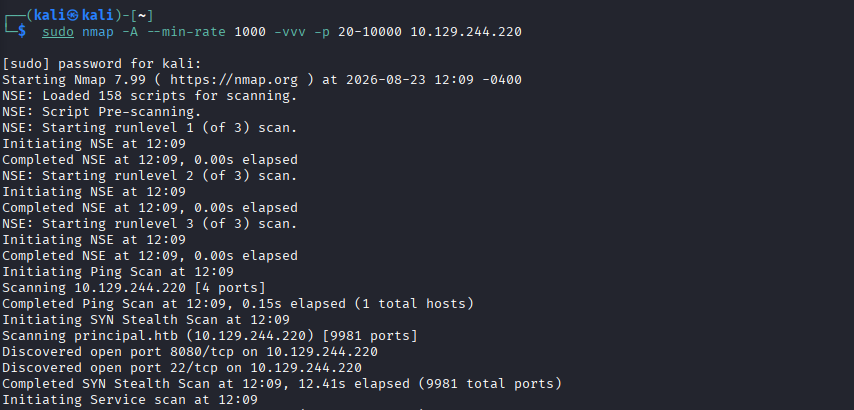

На веб-сервисе нашёл `pac4j`.

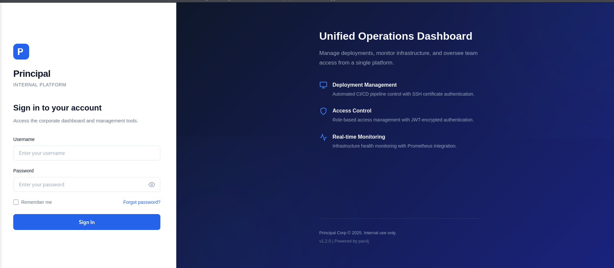

Точную версию снаружи определить не получилось. Здесь сработала инженерная интуиция, основанная на сложности машины: поскольку это Medium, логично было проверить критические уязвимости в используемом стеке, особенно при наличии публичного PoC.

Начал с CVE Details: сначала посмотрел уязвимости для pac4j, затем проверил более свежие версии. В результате вышел на 6.3.2rc1 и CVE-2026-29000.

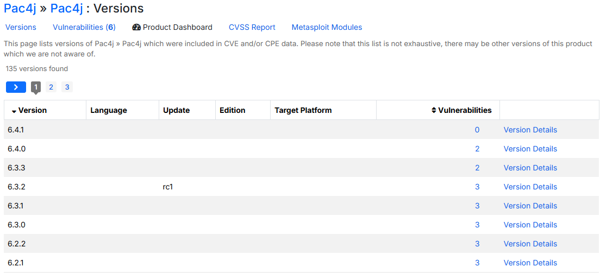

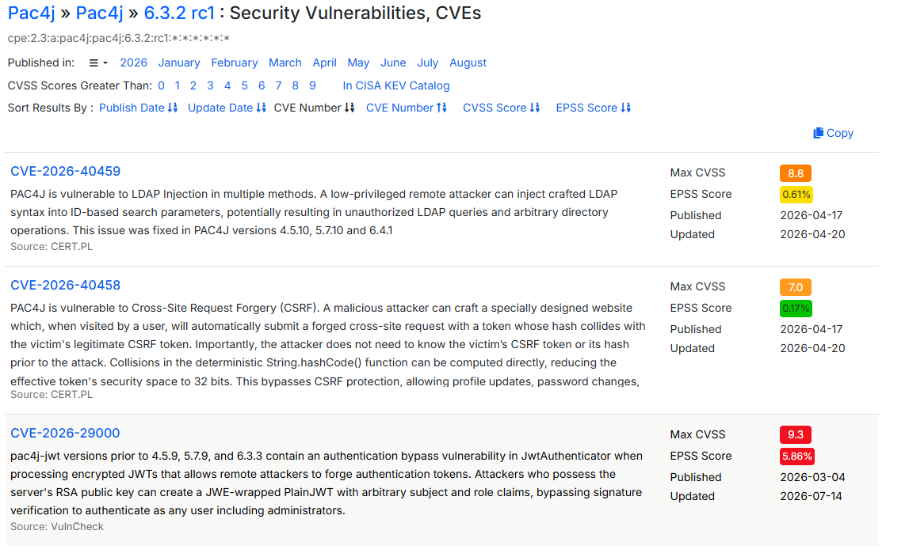

Далее проверил GitHub на наличие публичного PoC и нашёл:

`CVE-2026-29000-pac4j-jwt-auth-bypass`

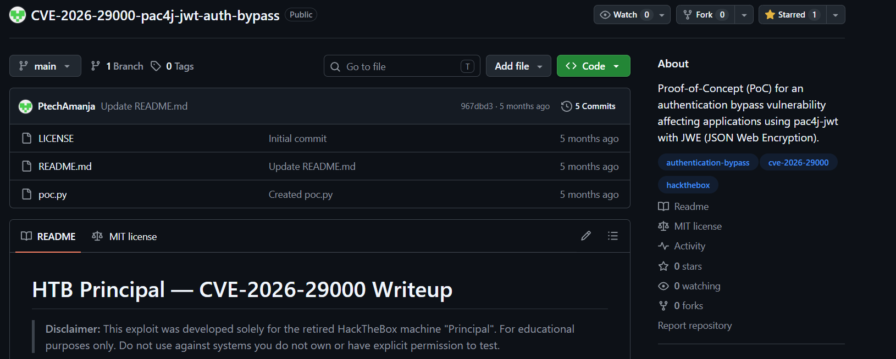

Репозиторий: [PtechAmanja/CVE-2026-29000-pac4j-jwt-auth-bypass](https://github.com/PtechAmanja/CVE-2026-29000-pac4j-jwt-auth-bypass)

Автор отдельно указывает, что этот эксплойт был написан для этой машины, поэтому именно его я проверил в первую очередь.

## Точка входа (Foothold)

PoC получает JWKS с целевого сервера. В исходном скрипте я захардкодил URL вместо передачи его через args и удалил получение аргументов в функции main(), чтобы не устанавливать дополнительную библиотеку для обработки аргументов в Python venv.

    jwks = requests.get('http://10.129.244.220:8080/api/auth/jwks').json()["keys"][0]

После запуска получил forged JWT token.

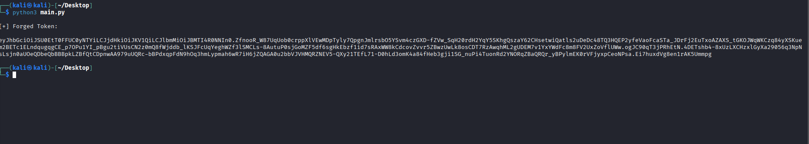

Затем установил токен в браузере через sessionStorage:

    sessionStorage.setItem("auth_token", "<PASTE_TOKEN_HERE>")

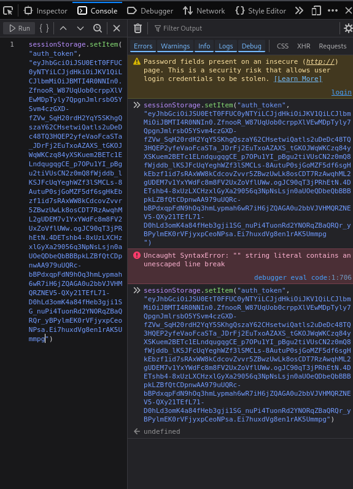

После перехода на /dasboard получил доступ с привилегиями admin.

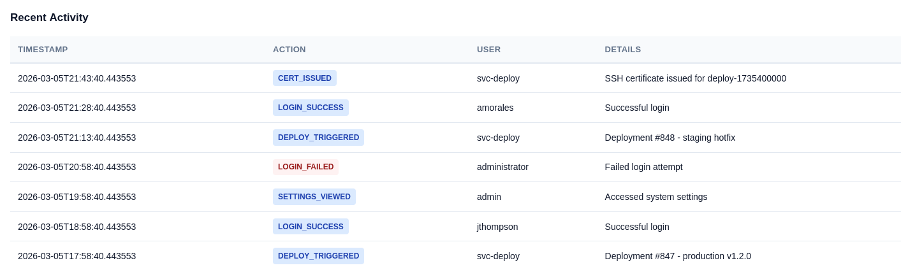

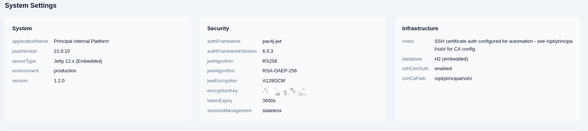

В админке особенно интересными оказались `encryptionkey` и `sshCaPath`.

    /opt/path/principal

После просмотра пользователей обнаружил svc-deploy. Этот аккаунт используется для деплоя и ротаций корневых SSH сертификатов, что сразу указывало на возможное направление для дальнейшего PrivEsc..

Затем попробовал подключиться по SSH под svc-deploy, используя encryptionkey в качестве пароля. Password reuse сработал.

    ssh svc-deploy@10.129.244.220

После входа получил `user.txt`.

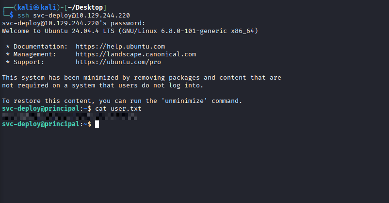

## Повышение привилегий (PrivEsc)

После получения доступа проверил:

    /opt/path/principal/README.txt

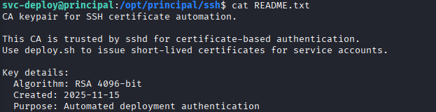

Затем выполнил команду:

    id

И обнаружил нестандартную группу:

    deployers

Затем проверил SSH-конфигурацию. В ней было видно, что ключи, подписанные /opt/principal/ssh/ca, являются доверенными для этой системы.

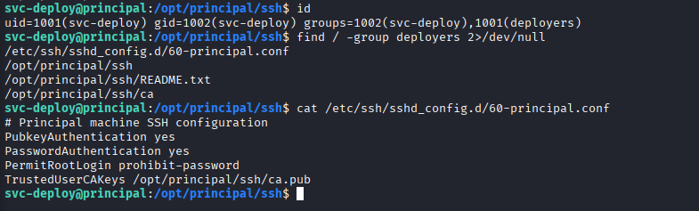

Имея доступ к svc-deploy и зная, что этот пользователь связан с ротаций корневых SSH сертификатов, следующим шагом стала генерация новой пары ключей в /tmp/ и её подпись доверенным CA.

    ssh-keygen -t rsa -f /tmp/root_key

После этого ключ был подписан доверенным CA.

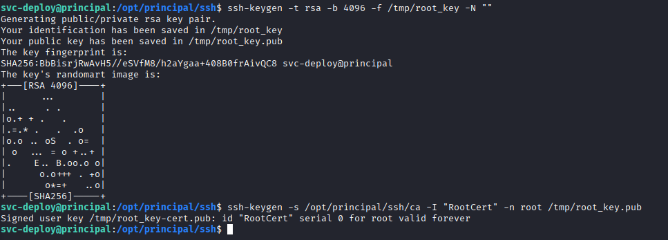

После получения подписанного ключа выполнил SSH-вход под 'root'

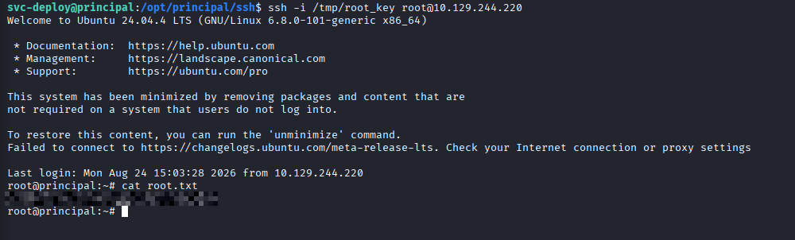

После входа под `root` получил `root.txt`.